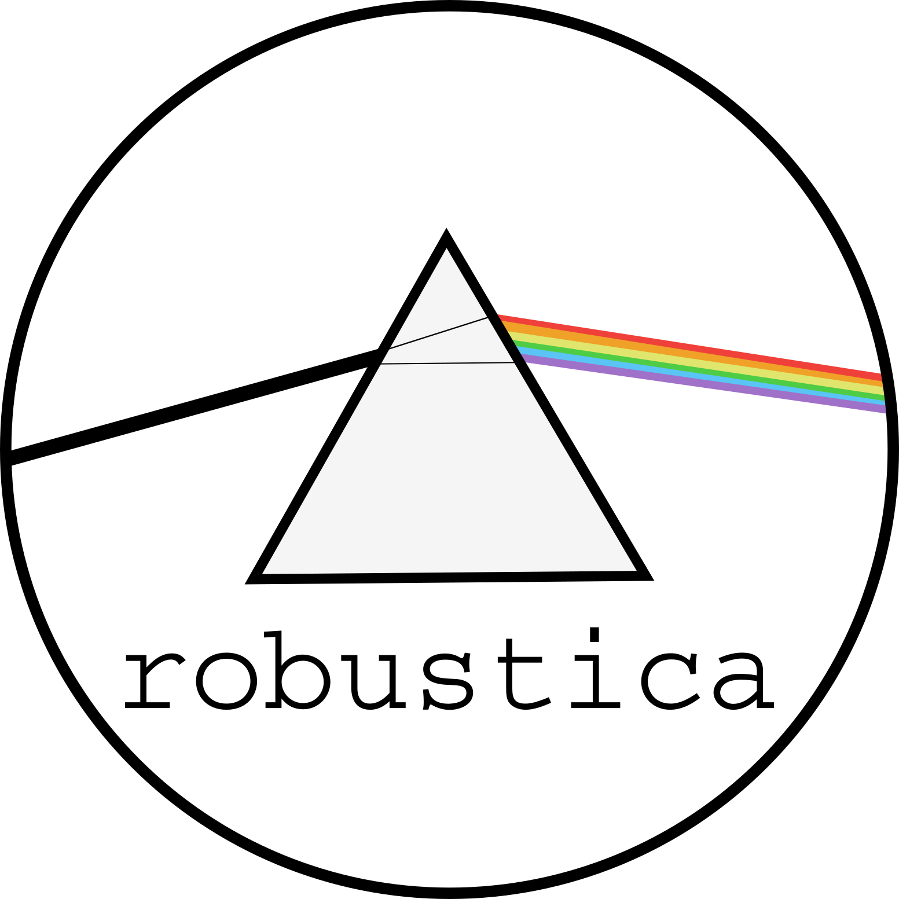

<p align="center">
  
</p>

Fully customizable robust Independent Component Analysis (ICA).

[](https://pypi.python.org/pypi/robustica)
[](https://opensource.org/licenses/BSD-3-Clause)

## Description
This package contains 3 modules:
- `RobustICA`

    Defines the most important class that allows to perform and customize robust independent component analysis.
    
- `InferComponents`

    Retrieves the number of components that explain a user-defined percentage of variance.

- `examples`
    
    Contains handy functions to quickly create or access example datasets.

## Requirements
In brackets, versions of packages used to revelop `robustica`.
- `numpy` (1.19.2)
- `pandas` (1.1.2)
- `scipy` (1.6.2)
- `scikit-learn` (0.23.2)
- `scikit-learn-extra` (0.2.0)
- `joblib` (1.0.1)
- `tqdm` (4.59.0)

## Installation
### pip
```shell
pip install robustica
```
### local
```shell
git clone https://github.com/MiqG/robustica.git
cd robustica
pip install -e .
```

## Usage
```python
from robustica import RobustICA
from robustica.examples import make_sampledata

X = make_sampledata(ncol=300, nrow=2000, seed=123)

rica = RobustICA(n_components=10)
S, A = rica.fit_transform(X)
```

## Tutorials
- [Basic pipeline for exploratory analysis](https://github.com/CRG-CNAG/robustica/blob/main/tutorials/basics.ipynb)
- [Using a custom clustering class](https://github.com/CRG-CNAG/robustica/blob/main/tutorials/customize_clustering.ipynb)
- [Inferring the number of components](https://github.com/CRG-CNAG/robustica/blob/main/tutorials/infer_components.ipynb)


## Contact
This project has been fully developed at the [Centre for Genomic Regulation](https://www.crg.eu/) within the group of [Design of Biological Systems](https://www.crg.eu/en/luis_serrano)

Please, report any issues that you experience through this repository's ["Issues"](https://github.com/CRG-CNAG/robustica/issues) or email:
- [Miquel Anglada-Girotto](mailto:miquel.anglada@crg.eu)
- [Sarah A. Head](mailto:sarah.dibartolo@crg.eu)
- [Luis Serrano](mailto:luis.serrano@crg.eu)

## License

`robustica` is distributed under a BSD 3-Clause License (see [LICENSE](https://github.com/CRG-CNAG/robustica/blob/main/LICENSE)).

## References
- *Himberg, J., & Hyvarinen, A.* "Icasso: software for investigating the reliability of ICA estimates by clustering and visualization". IEEE XIII Workshop on Neural Networks for Signal Processing (2003). DOI: https://doi.org/10.1109/NNSP.2003.1318025
- *Sastry, Anand V., et al.* "The Escherichia coli transcriptome mostly consists of independently regulated modules." Nature communications 10.1 (2019): 1-14. DOI: https://doi.org/10.1038/s41467-019-13483-w
- *Kairov, U., Cantini, L., Greco, A. et al.* Determining the optimal number of independent components for reproducible transcriptomic data analysis. BMC Genomics 18, 712 (2017). DOI: https://doi.org/10.1186/s12864-017-4112-9
